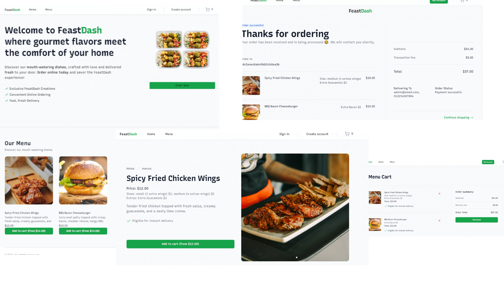
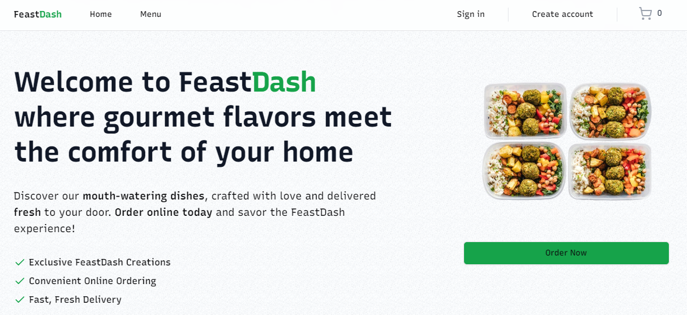
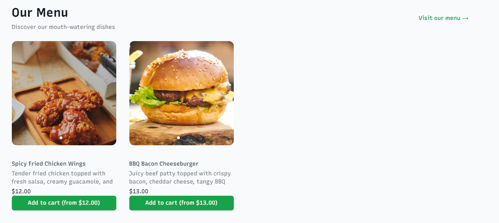
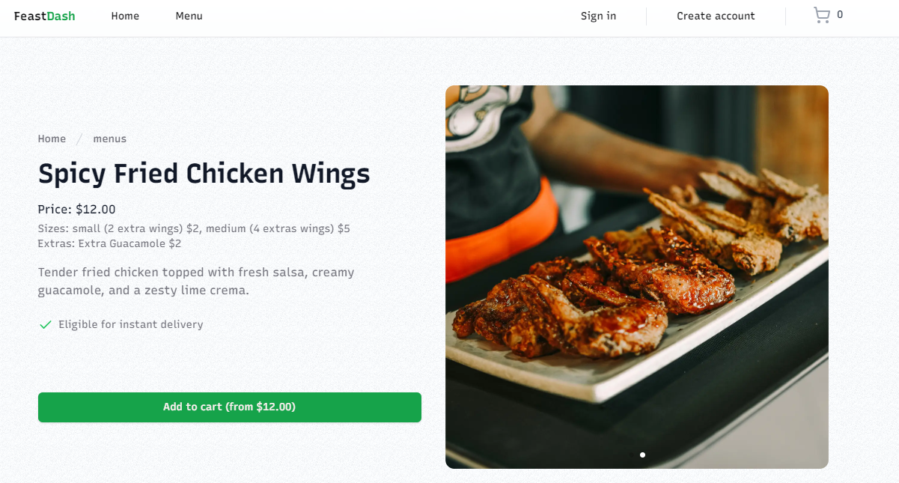
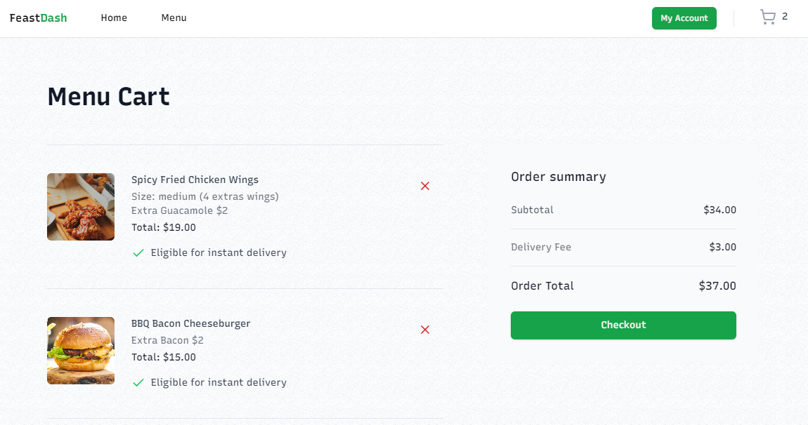
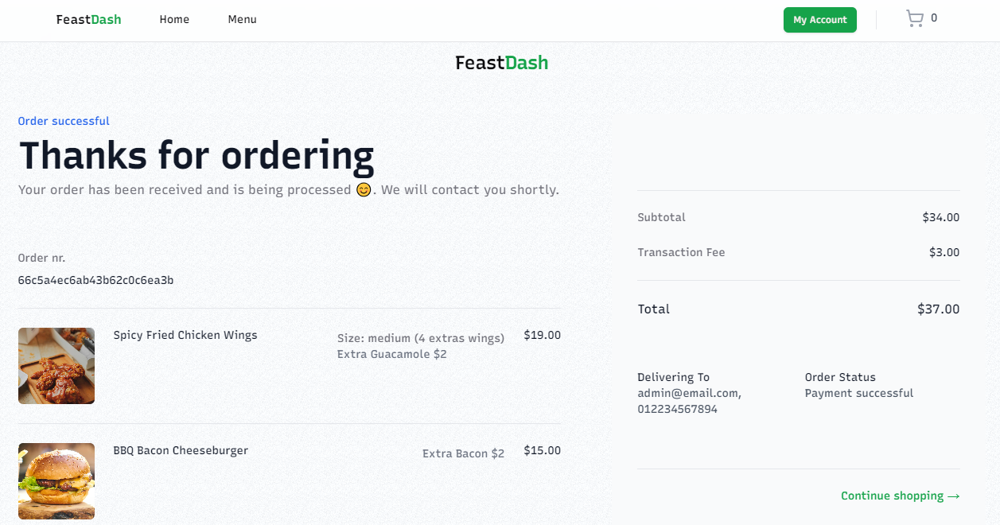
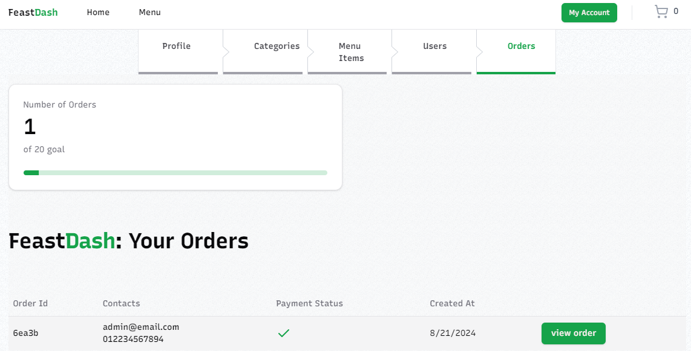

# FeastDash

Food ordering platform built with Next.js 14 App Router, TypeScript, MongoDB, and TailWind CSS.

FeastDash is a food-ordering web application that aims to simplify and enhance the online food ordering experience. Users can browse various food categories, view menus, add items to their cart, place orders, and make payments seamlessly. The application ensures a user-friendly interface, fast performance, and secure transactions.

## 🔗 Links

[](https://alex-portfolio-lun2.onrender.com/) &nbsp; &nbsp;

[](https://feast-dash.vercel.app/) &nbsp; &nbsp;

[](https://www.linkedin.com/in/alexkasema/)



## Inspiration Behind FeastDash

The idea behind FeastDash was to create a food-ordering application that would serve as a foundation for gaining hands-on experience in developing a functional and scalable online ordering system. This project has equipped me with the knowledge and skills needed to create similar ordering applications that could be applied across various industries, including restaurants, retail, and services. With the expertise I've acquired through FeastDash, I aim to help small businesses establish online shops, making their offerings more accessible and increasing their revenue by tapping into a wider customer base.

## Features

- User authentication with role-based access
- Easy-to-use menu interface
- Customers can easily make food orders
- Secure Stripe payment integration
- Manage Orders
- Manage Users
- Manage Cart and Stripe Checkout
- Responsive design with Tailwind CSS
- Clean, modern UI on top of shadcn-ui
- Built with modern technologies: NextJS, MongoDB, and TypeScript

## Usage

- Create a MongoDB database and obtain your MongoDB URI
- Create a Stripe account and obtain your

  - SECRET KEY
  - WEBHOOK SECRET

- To upload a menu item Create a Cloudinary account and obtain your
  - CLOUD NAME
  - API KEY
  - API SECRET
  - UPLOAD PRESET

## Environment Variables

Rename the .env.example file to .env and add the following

`MONGODB_URI=`

`NEXTAUTH_SECRET=`

`NEXTAUTH_URL=`

`NEXT_PUBLIC_CLOUDINARY_CLOUD_NAME=`

`NEXT_PUBLIC_CLOUDINARY_UPLOAD_PRESET=`

`CLOUDINARY_API_KEY=`

`CLOUDINARY_API_SECRET=`

`STRIPE_SECRET_KEY=`

`STRIPE_WEBHOOK_SECRET=`

### NEXTAUTH_SECRET

- This just needs to be any long, random string. You can google "secret key generator".

### NEXTAUTH_URL

- The NEXTAUTH_URL should point to the URL where your NextJS application is running.

## Running the App

### Cloning the Repository

Start by cloning the repository to your local machine:

```bash
  https://github.com/alexkasema/feast-dash.git
  cd feast-dash
```

### Install Dependencies:

```bash
    npm install
```

### Run:

```bash
    npm run dev
```

## Contributing

Contributions are always welcome!

1. Clone repo and create a new branch: $ git checkout https://github.com/alexkasema/feast-dash.git -b name_for_new_branch.

2. Make changes and test

3. Submit Pull Request with comprehensive description of changes

## Related

Here are some related projects

[MaliGreens](https://github.com/alexkasema/maligreens) This is a Fruits and Vegetables store app.








## License

MIT License

Copyright (c) 2024 Alex Kasema

Permission is hereby granted, free of charge, to any person obtaining a copy
of this software and associated documentation files (the "Software"), to deal
in the Software without restriction, including without limitation the rights
to use, copy, modify, merge, publish, distribute, sublicense, and/or sell
copies of the Software, and to permit persons to whom the Software is
furnished to do so, subject to the following conditions:

The above copyright notice and this permission notice shall be included in all
copies or substantial portions of the Software.

THE SOFTWARE IS PROVIDED "AS IS", WITHOUT WARRANTY OF ANY KIND, EXPRESS OR
IMPLIED, INCLUDING BUT NOT LIMITED TO THE WARRANTIES OF MERCHANTABILITY,
FITNESS FOR A PARTICULAR PURPOSE AND NONINFRINGEMENT. IN NO EVENT SHALL THE
AUTHORS OR COPYRIGHT HOLDERS BE LIABLE FOR ANY CLAIM, DAMAGES OR OTHER
LIABILITY, WHETHER IN AN ACTION OF CONTRACT, TORT OR OTHERWISE, ARISING FROM,
OUT OF OR IN CONNECTION WITH THE SOFTWARE OR THE USE OR OTHER DEALINGS IN THE
SOFTWARE.
